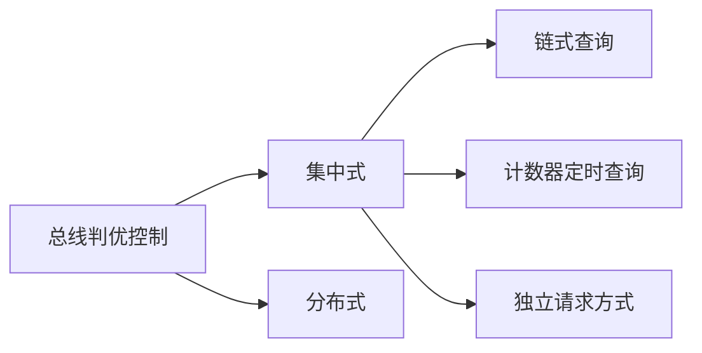

### 1. 计算机发展历程

#### 1.1 硬件的发展

- 第一代计算机：(使用电子管)，
- 第二代计算机：(使用晶体管)，
- 第三代计算机：(使用较小规模的集成)，
- 第四代计算机：(使用较大规模的集成)，

#### 1.2 软件的发展

各种软件及操作系统的蓬勃发展

#### 1.3 计算机的分类和发展方向

分为：

- 电子模拟计算机和电子数字计算机。

数字计算机又可以按照用途分为：

- 专用计算机和通用计算机

通用计算机又分为：

- 巨型机、大型机、中型机、小型机、微型机和单片机6类。

按照指令和数据流可以分为：

- 单指令流和单数据流系统（SISD），即传统的冯·诺依曼体系结构。

- 单指令流和多数据流系统（SIMD），包括阵列处理器和向量处理器系统。

- 多指令流和单数据流系统（MISD），这种计算机实际上不存在。

- 多指令流和多数据流系统（MIMD），包括多处理器和计算机系统。

### 2. 计算机系统层次结构


#### 2.1 计算机系统的组成

由硬件系统和软件系统共同构建

#### 2.2 计算机硬件的基本组成

1. 早期的冯诺依曼机

----

程序存储原理：指令以代码的形式事先输入到计算机的主存储器中，然后按其在存储器中的首地址执行程序的第一条指令，以后就按该程序的规定顺序执行其他指令，直至程序执行结束。即按地址访问并顺序执行指令

计算机按照此原理应具有5大功能：数据传送功能、数据存储功能、数据处理功能、操作控制功能、操作判断功能

---


- 冯诺曼体系结构特点:

1. 计算机硬件系统由五大部件组成(存储器、运算器、控制器、输出设备、输入设备)
2. 指令和数据以同等地位存于存储器，可按地址寻访
3. 指令和数据用二进制表示
4. 指令由操作码和地址码组成
5. 存储程序
6. 以**运算器**为中心

早期的冯·诺依曼机以运算器为中心，且是单处理机，**最根本的特征**是采用“**存储程序**”原理，基本工作方式是控制流驱动方式！

2. 现代计算机的组织结构


**注意各箭头表示的含义**

#### 2.3 计算机的功能部件

主机：主存、运算器、控制器


1. 存储器的基本组成


设 **MAR = 4位**   **MDR = 8位**

则 存储单元16个    每个存储单元存储字长8位

2. 运算器的基本组成及操作过程


3. 控制器的基本组成


PC指向的是下一次执行的指令，IR指向的是当前要执行的指令

---

一般将**运算器和控制器集成**到同一个芯片上，称为中央处理器(**CPU**)。**CPU和主存储器**共同构成**主机**，而除主机外的其他硬件装置(外存、I/O设备等)统称为外部设备，简称**外设**


4. 主机构造和执行指令


CPU和主存之间通过一组总线相连，总线中有地址、控制和数据3组信号线。MAR中的地址信息会直接送到地址线上，用于指向读/写操作的主存存储单元；控制线中有读/写信号线，指出数据是从CPU写入主存还是从主存读出到CPU,根据是读操作还是写操作来控制将MDR中的数据是直接送到数据线上还是将数据线上的数据接收到MDR中。


**主机完成一次指令的过程**:

取数操作为例


#### 2.4 计算机硬件的性能指标


1. 机器字长： cpu 一次能处理数据的位数，与cpu中的 **寄存器位数**有关，机器字长**一般等于内部寄存器的大小**，它决定了**计算机的运算精度**。

---

机器字长：计算机能直接处理的二进制数据的位数，机器字长一般等于内部寄存器的大小，它决定了计算机的运算精度。
指令字长：一个指令字中包含的二进制代码的位数。
存储字长：一个存储单元存储的二进制代码的长度。等于MDR的位数， 它们都必须是字节的整数倍。
数据字长：数据总线一次能传送信息的位数，它可以不等于MDR的位数。

指令字长一般取存储字长的整数倍，若指令字长等于存储字长的2倍，则需要2次访存来取出一条指令，因此取指周期为机器周期的2倍；若指令字长等于存储字长，则取指周期等于机器周期。

早期的计算机存储字长一般和机器的指令字长与数据字长相等，因此访问一次主存便可取出一条指令或一个数据。随着计算机的发展，指令字长可变，数据字长也可变，但它们必须都是字节的整数倍。

请注意64位操作系统是指特别为64位架构的计算机而设计的操作系统，它能够利用64位处理器的优势。但64位机器既可以使用64位操作系统，又可以使用32位操作系统。而32位处理器是无法使用64位操作系统的。


2. 运算速度：

- 主频

- 吉普森法
  $$
  T_M = \sum_{i=1}^{n}f_it_i
  $$
  
- MIPS   每秒执行百万条指令
- FLOPS   每秒浮点运算次数
- CPI   执行一条指令所需时钟周期数


#### 2.5 计算机软件的分类

1. 系统软件和应用软件
2. 三个级别的语言

### 3.数据的表示与运算


#### 3.1数制与编码

##### 1.进位计数值及其相互转化

**进制之间的相互转换，乘x除x法**  

**1位16进制数等价于4位二进制数,    一位8进制数等价于3位二进制数**

##### 2.BCD码   用二进制数表示十进制

**这是为了表示0和9，所以1010~1111都是违法的**


##### 3.字符与字符串

英文字符的表示  ASCII码

中文字符的表示  GDB等其他编码

**字符串的大小端模式**

---

- 大端模式：将数据的最高有效字节存放在低地址单元中
- 小端模式：将数据的最高有效字节存放在高地址单元中


##### 4.校验码

待补充...

#### 3.2 定点数的表示和运算

**定点数和浮点数是一对相对的概念**

**整数的小数点表示在最后一位数字的后面，而小数的小数点标识在真值的符号位后面**

##### 1.定点数的移位规则


- 将+26的原码、补码和反码分别左移一位 结果是：[26]原 = [26]反 = [26]补 = 0,0011010，根据规则，原码、反码、补码左移一位的结果是：0,010100 
- 将-26的原码、反码、补码分别左移一位 [-26]原 = 1,0011010，左移一位：1,0110100 [-26]反 = 1,1100101,左移一位：1,1001011 [-26]补 = 1,1100110，左移一位：1,100110

##### 2.定点数的加减法

**加法直接加，减法先变为加法后再计算**

[A+B]补 = [A+B]补，[A-B]补 = [A]补 + [-B]补

- A = -1001，B = -0101，求[A+B]补 [A+B]补 = [A]补 + [B]补，[A]补 = 1,0111，[B]补 = 1,1011，所以最终的结果是：11,0010，但是这并非我们的最终结果，最终结果应该丢掉第一个1，即1,0010.为什么呢？这涉及到一个模2运算的问题，如果不想深究只需要记住，**一个数只能有一个符号位不是吗？** 
- A = -1001，B=-0101.求[A-B]补 [A-B]补 = [A]补 + [-B]补，[A]补=1,0111，[-B]补=0,0101（求法：**[-B]补等于[B]补符号位和各位取反，末位加一**），这样得到最终的结果，丢弃掉多余的位即可。

**溢出的判断**：如果计算机的机器字长为4，那么能够表示的真值范围在-8~+7之间，如果两个数相加减，跳出了这个范围，则为溢出

**判断原则：**

- **不论加法还是减法，只要实际参与运算的两个数的符号相同，但是与最终的结果的符号相反，则为溢出。**比如我们的第一个例子，两个参与运算的数的符号相同，且和最终结果的符号也相同，则这种情况就不是溢出。
- **最终结果的两位符号位如果相同，则无溢出，如果不同则溢出**，还是第一个例子，计算后的结果是11,0010，两位符号位相同，没有溢出。

补码加法硬件配置


##### 3.定点数的乘法

1. 原码乘法

一位


- 绝对值运算
- 用移位的次数判断乘法是否结束
- 逻辑移位

两位


2. 补码乘法


##### 4.定点数的除法

1. 恢复余数法


2. 不恢复余数法


- 上商n+1次
- 第一次上商判溢出
- 移n次，加n+1次
- 用移位的次数判断除法是否结束

#### 3.3 浮点数的表示与运算

用定点数表示数字时，会约定小数点的位置固定不变，整数部分和小数部分分别转换为二进制，就是定点数的结果。

但用定点数表示小数时，存在数值范围、精度范围有限的缺点，所以在计算机中，我们一般使用「浮点数」来表示小数。

其中「定点」指的是约定小数点位置固定不变。那浮点数的「浮点」就是指，其**小数点的位置**是可以是**漂浮不定**的。


例如十进制小数 8.345，用科学计数法表示，可以有多种方式：

```
8.345 = 8.345 * 10^0
8.345 = 83.45 * 10^-1
8.345 = 834.5 * 10^-2
...
```

用这种科学计数法的方式表示小数时，小数点的位置就变得「漂浮不定」了，这就是相对于定点数，浮点数名字的由来。

使用同样的规则，对于二进制数，我们也可以用科学计数法表示，也就是说把基数 10 换成 2 即可。


##### 浮点数如何表示数字：

```
V = (-1)^S * M * R^E
```

其中各个变量的含义如下：

- S：符号位，取值 0 或 1，决定一个数字的符号，0 表示正，1 表示负
- M：尾数，用小数表示，例如前面所看到的 8.345 * 10^0，8.345 就是尾数
- R：基数，表示十进制数 R 就是 10，表示二进制数 R 就是 2
- E：指数，用整数表示，例如前面看到的 10^-1，-1 即是指数

假设现在我们用 32 bit 表示一个浮点数，把以上变量按照一定规则，填充到这些 bit 上就可以了：

[](https://kaito-blog-1253469779.cos.ap-beijing.myqcloud.com/2020/12/16090678516816.jpg)

假设我们定义如下规则来填充这些 bit：

- 符号位 S 占 1 bit
- 指数 E 占 10 bit
- 尾数 M 占 21 bit

按照这个规则，将十进制数 25.125 转换为浮点数，转换过程就是这样的（D代表十进制，B代表二进制）：

1. 整数部分：25(D) = 11001(B)
2. 小数部分：0.125(D) = 0.001(B)
3. 用二进制科学计数法表示：25.125(D) = 11001.001(B) = 1.1001001 * 2^4(B)

所以符号位 S = 0，尾数 M = 1.001001(B)，指数 E = 4(D) = 100(B)。

按照上面定义的规则，填充到 32 bit 上，就是这样：

[](https://kaito-blog-1253469779.cos.ap-beijing.myqcloud.com/2020/12/16090693834968.jpg)


上述规则只是随意设置的，若按新规则来，那浮点数表示出来也可以这样：

[](https://kaito-blog-1253469779.cos.ap-beijing.myqcloud.com/2020/12/16090693834973.jpg)

可以看到：

1. 指数位越多，尾数位则越少，其表示的范围越大，但精度就会变差，反之，指数位越少，尾数位则越多，表示的范围越小，但精度就会变好
2. 一个数字的浮点数格式，会因为定义的规则不同，得到的结果也不同，表示的范围和精度也有差异

早期人们提出浮点数定义时，就是这样的情况，当时有很多计算机厂商，例如IBM、微软等，每个计算机厂商会定义自己的浮点数规则，

##### 浮点数标准

直到1985年，IEEE 组织推出了浮点数标准，就是我们经常听到的 **IEEE754 浮点数标准**，这个标准统一了浮点数的表示形式，并提供了 2 种浮点格式：

- 单精度浮点数 float：32 位，符号位 S 占 1 bit，指数 E 占 8 bit，尾数 M 占 23 bit
- 双精度浮点数 double：64 位，符号位 S 占 1 bit，指数 E 占 11 bit，尾数 M 占 52 bit

为了使其表示的数字范围、精度最大化，浮点数标准还对指数和尾数进行了规定：

1. 尾数 M 的第一位总是 1（因为 1 <= M < 2），因此这个 1 可以省略不写，它是个**隐藏位**，这样单精度 23 位尾数可以表示了 24 位有效数字，双精度 52 位尾数可以表示 53 位有效数字
2. 指数 E 是个无符号整数，表示 float 时，一共占 8 bit，所以它的取值范围为 0 ~ 255。但因为指数可以是负的，所以规定在存入 E 时在它原本的值加上一个**中间数** 127，这样 E 的取值范围为 -127 ~ 128。表示 double 时，一共占 11 bit，存入 E 时加上中间数 1023，这样取值范围为 -1023 ~ 1024。

除了规定尾数和指数位，还做了以下规定：

- 指数 E 非全 0 且非全 1：规格化数字，按上面的规则正常计算
- 指数 E 全 0，尾数非 0：非规格化数，尾数隐藏位不再是 1，而是 0(M = 0.xxxxx)，这样可以表示 0 和很小的数
- 指数 E 全 1，尾数全 0：正无穷大/负无穷大（正负取决于 S 符号位）
- 指数 E 全 1，尾数非 0：NaN(Not a Number)

[](https://kaito-blog-1253469779.cos.ap-beijing.myqcloud.com/2020/12/16090749848677.jpg)

[3](https://kaito-blog-1253469779.cos.ap-beijing.myqcloud.com/2020/12/16090749848677.jpg)


##### 标准浮点数的表示

有了这个统一的浮点数标准，我们再把 25.125 转换为标准的 float 浮点数：

1. 整数部分：25(D) = 11001(B)
2. 小数部分：0.125(D) = 0.001(B)
3. 用二进制科学计数法表示：25.125(D) = 11001.001(B) = 1.1001001 * 2^4(B)

所以 S = 0，尾数 M = 1.001001 = 001001(去掉1，隐藏位)，指数 E = 4 + 127(中间数) = 135(D) = 10000111(B)。填充到 32 bit 中，如下：

[](https://kaito-blog-1253469779.cos.ap-beijing.myqcloud.com/2020/12/16090678516830.jpg)

这就是标准 32 位浮点数的结果。

如果用 double 表示，和这个规则类似，指数位 E 用 11 bit 填充，尾数位 M 用 52 bit 填充即可。

**注：**

> float 1位符号位，8位阶码位（移码表示，偏移127，取值范围为1~254，0和255表示特殊值），23位尾数（隐含1），所以能表示的最大正整数为 （1+1-2^-23）* 2^127
>
> double 1位符号位，11位阶码位（偏移 1023），52位尾数位（隐含1），所以能表示的最大正整数为（1+1-2^52）* 2^1023


##### 浮点数的范围和精度

以单精度浮点数 float 为例，它能表示的最大二进制数为 +1.1.11111…1 * 2^127（小数点后23个1），而二进制 1.11111…1 ≈ 2，所以 float 能表示的最大数为 2^128 = 3.4 * 10^38，即 float 的表示范围为：-3.4 * 10^38 ~ 3.4 * 10 ^38。

**精度：**

float 能表示的最小正二进制数为 0.0000….1（小数点后22个0，1个1），用十进制数表示就是 1/2^23。

用同样的方法可以算出，double 能表示的最大二进制数为 +1.111…111（小数点后52个1） * 2^1023 ≈ 2^1024 = 1.79 * 10^308，所以 double 能表示范围为：-1.79 * 10^308 ~ +1.79 * 10^308。

double 的最小精度为：0.0000…1(51个0，1个1)，用十进制表示就是 1/2^52。

虽然浮点数的范围和精度也有限，但其范围和精度**都已非常之大**


总结

---

1. 浮点数一般用科学计数法表示
2. 把科学计数法中的变量，填充到固定 bit 中，即是浮点数的结果
3. 在浮点数提出的早期，各个计算机厂商各自制定自己的浮点数规则，导致不同厂商对于同一个数字的浮点数表示各不相同，在计算时还需要先进行转换才能进行计算
4. 后来 IEEE 组织提出了浮点数的标准，统一了浮点数的格式，并规定了单精度浮点数 float 和双精度浮点数 double，从此以后各个计算机厂商统一了浮点数的格式，一直延续至今
5. 浮点数在表示小数时，由于十进制小数在转换为二进制时，存在无法精确转换的情况，而在固定 bit 的计算机中存储时会被截断，所以浮点数表示小数可能存在精度损失
6. 浮点数在表示一个数字时，其范围和精度非常大，所以我们平时使用的小数，在计算机中通常用浮点数来存储

> 补充: [负数补码表示范围以及规格化数](https://blog.csdn.net/qq_43855740/article/details/104721619)

#### 3.4 算数逻辑单元（ALU）

##### 1.ALU电路


ALU电路是一个**组合逻辑电路**，不含记忆功能，所以要接入寄存器

##### 2. 运算器的组成


##### 3.快速进位链

###### a. 并行加法器


###### b.串行进位链


###### c.并行进位链

先行进位链：电路复杂


1）单重分组跳跃进位链


2)   双重分组跳跃进位链


**进位分析**


**大组进位线路**


**小组进位线路**


### 4. 系统总线

总线概念

如果两两单独连接，则连接的网络十分庞大，而且难以扩展

#### 1.总线是各个部件共享的传输介质

总线上可以进行**串行**和**并行**两种传输方式

#### 2.总线结构


这种结构可扩展性强，但是任意时刻只能进行两个部件之间的信息传递，严重影响效率


**现代技术中 通常情况下这两条总线也很难同时工作**

#### 3.总线分类

1. 片内总线： 芯片内部的总线
2. 系统总线： **注意机器字长和存储字长的概念**


#### 4.总线特性及性能指标

1. 总线的物理实现


**总线是印刷在主板上的**，图中cpu插板等都是在主线上的接口

2. 总线的特性

a. 机械特性：**尺寸**、形状、**管脚数**及**排列顺序**

b. 电气特性： **传输方向** 和有效的 **电平**范围

c. 功能特性： 每根传输线的 **功能**（地址、数据、控制）

d. 时间特性： 信号的**时序**关系

3. 总线的性能指标

总线宽度：数据线的根数

标准传输率： 每秒传输的最大字节数(MBps)

时钟同步/异步： 同步、不同步

总线复用：地址线与数据线复用

信号线数：地址线、数据线和控制线的总和

总线控制方式：突发、自动、仲裁、逻辑、计数

其他指标：负载能力

4. 总线标准


 

#### 5.多总线结构


 


#### 6.总线控制

##### 一、总线判优控制

1. 主设备（模块） 对总线有 **控制权**

   从设备                **响应** 从主设备发来的总线命令



2.查询方式


##### 二、总线通信控制


1. 同步式数据输入


2. 同步式数据输出


3. 异步通信


4. 半同步通信


在同步通信之间插入**WAIT信号**

5. 总结上述三种通信的共同点
   一个总线传输周期（以输入数据为例）

- 主模块发地址、命令       占用总线
- 从模块准备数据               不占用总线总线空闲
- 从模块向主模块发数据   占用总线

 

分离式通信特点

- 各模块有权申请占用总线
- 采用同步方式通信，不等对方回答
- 各模块准备数据时，不占用总线
- 总线被占用时，无空闲
- <u>充分提高了总线的有效占用</u>


### 5.存储器

#### 5.1存储器的分类

按在计算机中的作用对存储器分类：

- 主存储器,简称**主存**。CPU可以直接随机地对其进行访问，也可以和高速缓存器及辅助存储器交换数据。

- 辅助存储器,简称**辅存**，不能与CPU直接相连，用来存放当前暂时不用的程序和数据

- **高速缓冲存储器**, 位于**主存和CPU之间**，用来存放正在执行的程序段和数据，作为cpu和主存之间的缓冲
- **Flash Memory**：可作为主存和辅存之间的临时存储器，也可以单独作为高性能存储器，为半导体元件，如U盘

按存储介质分类：

磁表面存储器（磁盘，磁带），磁心存储器半导体存储器（MOS型存储器，双极存储器）和光存储器（光盘）。

按存取方式分类：

- 随机存储器（**RAM**）。存储器的任何一个存储单元的内容都可以随机存取，而且存取时间与存取单元的物理位置无关，**主要用作主存或高速缓冲存储器**。

- 只读存储器（ROM）。存储器的内容只能随机读出而不能写入。即使断电，内容也不会丢失。

- 串行访问存储器。对存储单元进行读/写操作时，需按其物理位置的先后顺序寻址，包括**顺序存取存储器（如磁带）**与**直接存取存储器（如磁盘）**。

按信息的可保存性分类：

断电后，存储信息即消失的存储器，称为易失性存储器，如RAM。断电后信息仍然保持的存储器，称为非易失性存储器，如ROM，磁表面存储器和光存储器。若某个存储单元所存储的信息被读出时，原存储信息被破坏，则称为破坏性读出；若读出时，被读单元原存储信息不被破坏，则称为非破坏性读出。具有破坏性读出性能的存储器，每次读出操作后，必须紧接一个再生的操作，以便恢复被破坏的信息。


#### 5.2存储器的性能指标


#### 5.3存储器的层次结构

1.三个主要特征的关系


2.缓存一主存层次和主存一辅存层次


cpu提升速度远快于主存，所以在二者之间加了一个缓存

cpu可以通过直接访问缓存从而访问主存的信息

> 主存和缓存之间通过硬件直接设计连接到一起，不需要机器语言程序员考虑
>
> 而主存和辅存之间则软硬件结合

#### 5.4主存

##### 1.主存的基本组成


##### 2.主存和cpu的关系


##### 3.主存中存储单元地址的分配


##### 4.主存的技术指标


#### 5.5半导体存储芯片

##### 1.半导体存储芯片的基本结构


##### 2.半导体芯片译码驱动法

######   1.线选法


###### 2.重合法


##### 3.随机存取存储器（RAM）

###### 1.静态RAM(SRAM)


**读写操作**


###### 2.动态RAM(DRAM)


###### 3.DRAM和SRAM比较


##### 4.只读存储器（ROM）


##### 5.总结

