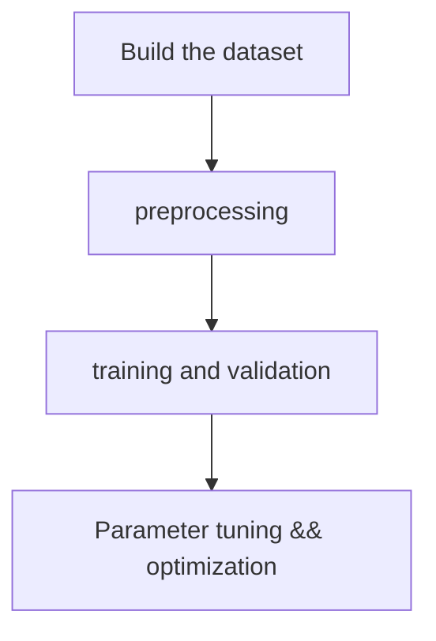

## 深度学习流程

### 流程简述



### 构建数据集：

1. 流程

first step: 收集数据：去大量抽样调查收集，爬虫（[youtube爬虫工具](https://github.com/MrS0m30n3/youtube-dl-gui)），众包（~~花钱找工具人~~）等等

second: 数据格式整理

third: 导入代码进行处理

2. code

   一般处理csv或者json等格式的文本格式文件，下为举例

   sklearn

   ```python
   import pandas as pd
   data = pd.read_json('data.json')
   # data = pd.read_csv('data.csv')
   ```

   pytorch

   ​	pytorch的项目预处理的时候可以用pandas、json等库处理，之后生成新的文件在构建模型前构造DataSet和DataLoader时直接读取数据集来load

   ```python
   train_dataset = MyDataset(csv_file='../data/data.csv',
   						root_dir='../data',
   						transform=torchvision.transforms.ToTensor())
   ```

### 数据集划分：

1. 基本知识

- 训练集（Train Set）: 模型用于训练和调整模型参数

- 验证集（Validation Set）: 用来验证模型精度和调整

- 测试集（Test Set）: 验证模型的泛化能力

> 训练集和验证集有时候是从同一数据集中分开的，但是在划分验证集时需要注意验证集的分布需和测试集尽量保持一致，保证其泛化性

几种划分方式：

- 留出法（Hold-Out）：直接将训练集划分为新的训练集和验证集。优点简单。缺点只得到了一份验证集，有可能导致模型在验证集上过拟合，适用于数据量比较大点的情况。
- 交叉验证法（Cross Validation,CV）：将训练集划分成K份，将其中的K-1份作为训练集，剩余的1份作为验证集，循环K训练。这种划分方式是所有的训练集都是验证集，最终模型验证精度是K份平均得到。这种方式的优点是验证集精度比较可靠，训练K次可以得到K个有多样性差异的模型；CV验证的缺点是需要训练K次，不适合数据量很大的情况。

- 自助采样法（BootStrap）：通过有放回的采样方式得到新的训练集和验证集，每次的训练集和验证集都是有区别的。这种划分方式一般适用于数据量较小的情况。

2. code: 

   sklearn

   ```python
   import pandas as pd
   import os
   from sklearn.ensemble import RandomForestClassifier
   from sklearn import metrics
   
   os.chdir('breast_cancer_data')
   data = pd.read_csv(r'data.csv')
   data.drop('Unnamed: 32',inplace = True,axis = 1)
   data.drop('id',inplace = True,axis=1)
   y = data['diagnosis']
   x = data.drop('diagnosis',axis = 1)
   model = RandomForestClassifier()
   ```

   留出法：

   ```python
   from sklearn.model_selection import train_test_split
   14x_train, x_test, y_train, y_test = train_test_split(x, y, test_size=0.33, random_state=42)
   ```

   k折交叉验证：

   ```python
   import numpy as np
   from sklearn.model_selection import KFold
   kf = KFold(n_splits = 10)
   accuracy = []
   for train_index, test_index in kf.split(x):
        x_train, x_test = x.loc[train_index],x.loc[test_index]
        y_train, y_test = y.loc[train_index],y.loc[test_index]
        model.fit(x_train, y_train)
        prediction = model.predict(x_test)
        acc=metrics.accuracy_score(predocton, y_test)
        accuracy,append(acc)
   print(accuracy)
   print(np.average(accuracy))
   ```

   pytorch:

   **torch.utils.data.Subset**或者**random_split**

   ```python
   train_dataset, test_dataset = torch.utils.data.random_split(full_dataset, [train_size, test_size])
   ```

   或者自定义分类数据集

   eg: 文本分类中可以根据文本数字先进行排序然后按照顺序每10个前9个放入训练集后1个放入测试集(若为9:1)，然后训练时再进行shuffle，这样保证了分布均匀的问题

### 模型训练和验证

1. 仔细检查数据：

   花时间去检查数据是一件比较重要的工作。因为数据中往往可能存在异常值，而且了解它们的分布可以有利于我们找到一个更好的模型。同时也可以对数据进行一开始的手动调整。

2. 搭建模型并开始训练验证

   评估框架提示

   - 固定随机种子：始终使用固定的随机种子来确保两次运行代码时，您将获得相同的结果。
   - 简化：去除不必要的一些操作
   - 验证损失：验证损失是否从正确的损失值开始
   - 设定一个好的初始化
   - 人类基线：监控除损失之外的指标，这些指标是人类可以解释和检查的（例如准确性）。尽可能评估自己（人类）的准确性并与之进行比较。
   - 可视化预测动态。训练过程中可视化固定测试批次上的模型预测对模型调整有很大帮助。

3. 过度拟合

找到一个好的模型的方法有两个阶段：首先获得一个足够大的模型以使其可以过度拟合（即专注于训练损失），然后适当地对其进行正则化（放弃一些训练损失以提高验证损失）。

此阶段的一些提示和技巧：

- 选择模型：为了减少训练损失，您需要为数据选择合适的体系结构。
- Adam是安全的。在设定基准的早期阶段，我喜欢以3e-4的学习率使用Adam 。以我的经验，亚当更宽容超参数，包括不良的学习速度。对于ConvNets，调整良好的SGD几乎总是比Adam稍胜一筹，但是最佳学习率区域要狭窄得多且针对特定问题。
- 一次只使一个复杂化。如果您有多个信号要插入您的分类器，我建议您将它们一个接一个地插入，并每次确保获得预期的性能提升。
- 不要相信学习率衰减的默认值。如果您要重新使用其他领域的代码，请务必小心学习率。

**4. 正则化**

此阶段的一些提示和技巧：

- 获取更多数据
- 数据扩充
- 创意增强：如果半假数据没有做到这一点，伪造数据也可能会有所作为。人们正在寻找扩展数据集的创新方法。例如，领域随机化，模拟的使用，巧妙的混合，例如将（潜在模拟的）数据插入场景，甚至GAN。
- 使用预训练网络
- 坚持监督学习
- 减小输入维数
- 减小模型尺寸
- 减小批量大小
- Dropout
- 提早停止训练。根据您测得的验证损失提前停止训练，以在模型快要过拟合的时候捕获模型。
- 尝试更大的模型。大型模型大多数最终会过拟合，但是它们的“早期停止”性能通常会比小型模型好得多。

**5. 微调**

此阶段的一些提示和技巧：

- 随机网格搜索
- 超参数优化

**6. 进一步提高精确率**

- 模型集成


代码参考搭建过的一些项目